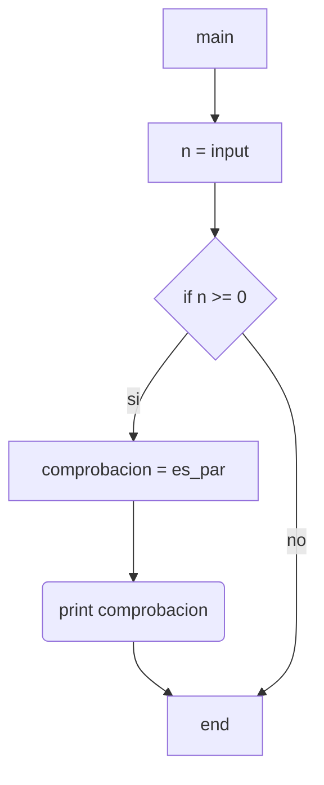
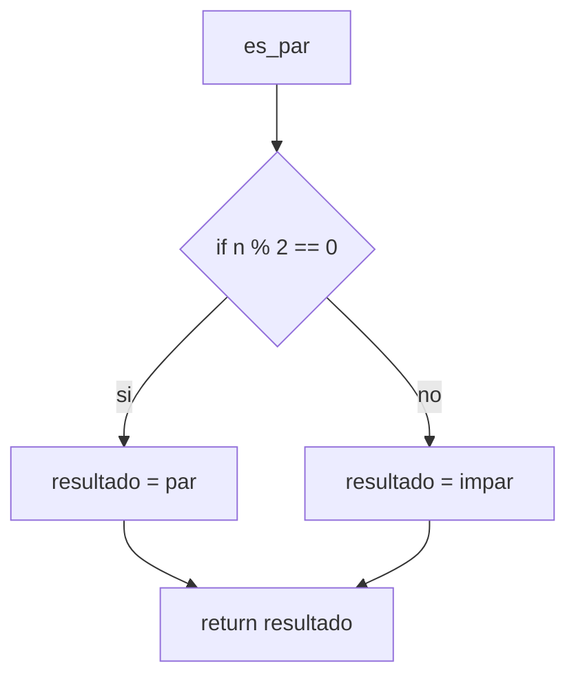

```mermaid
graph TD
    A[main] -->
    B[n = input] -->
    C{if n >= 0} -->
    |si|D[comprobacion = es_par] -->
    E(print comprobacion)-->
    F[end]
    C -->
    |no| F
```

```mermaid
graph TD
    G[es_par] -->

    H{if n % 2 == 0} -->
    |si| I[resultado = par] -->
    J[return resultado]
    H -->
    |no| K[resultado = impar] -->
    J
    
```
