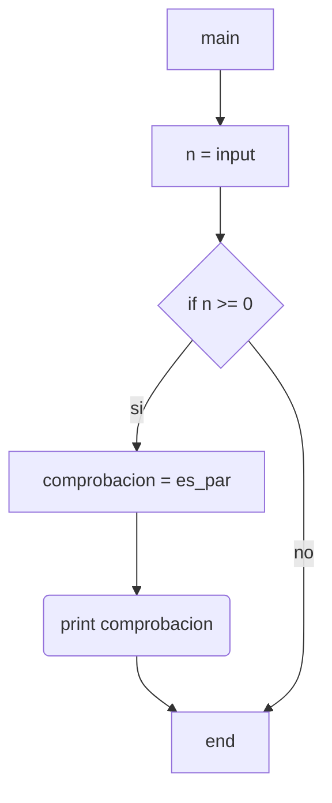
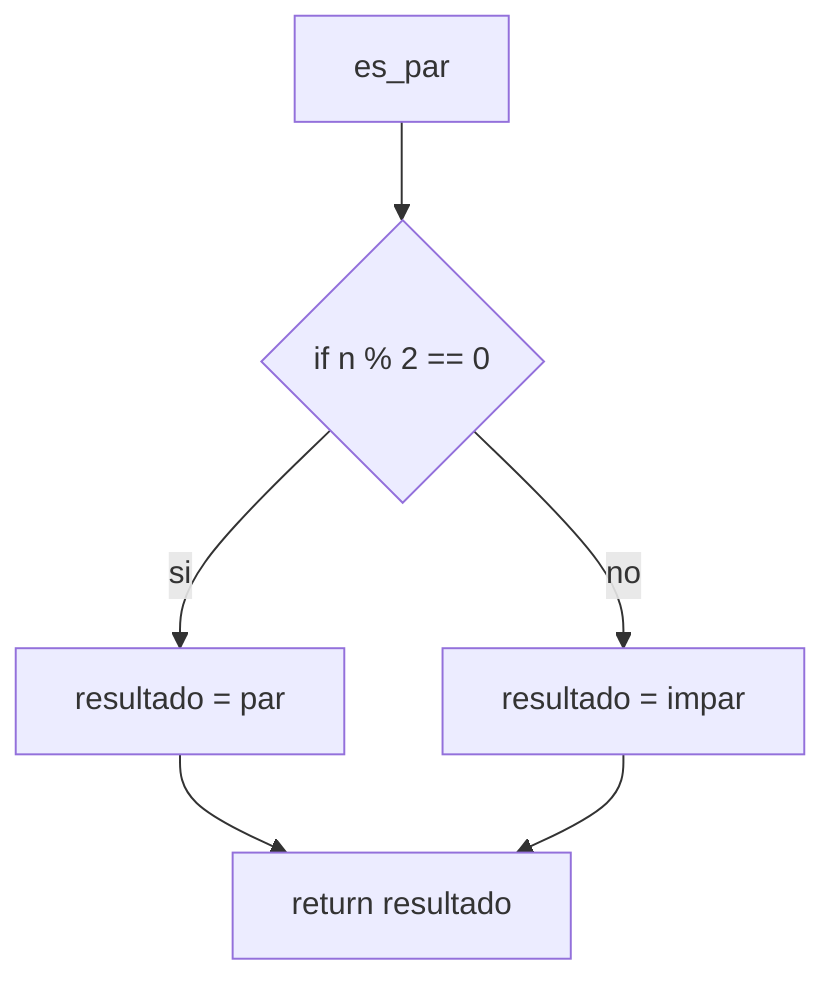

1) Ingresar un número natural en la variable N. Determinar e imprimir un mensaje informando: si ‘N
es PAR’ o si ‘N es IMPAR’.

Diagramas de flujo y calculos de complejidad:

***

* *main*:
    * V(G) = R = 2
    * V(G) = A-N+2 = 6-6+2 = 2
    * V(G) = P+1 = 1+1 =2

* *es_par()*:
    * V(G) = R = 2
    * V(G) = A-N+2 = 5-5+2 = 2
    * V(G) = P+1 = 1+1 = 2

