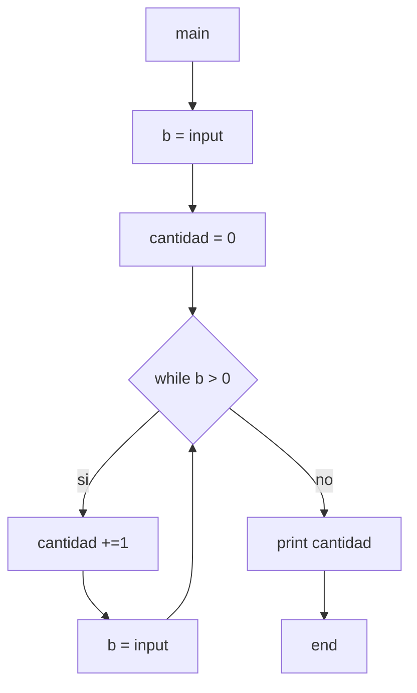

10) Ingresar números enteros en la variable B y, MIENTRAS el valor ingresado en B sea
POSITIVO, calcular la cantidad de números ingresados e imprimirla en un mensaje.

Diagramas de flujo y calculos de complejidad:

***

* *main*:
    * V(G) = R = 2
    * V(G) = A-N+2 = 8-8+2 = 2
    * V(G) = P+1 = 1+1 = 2
