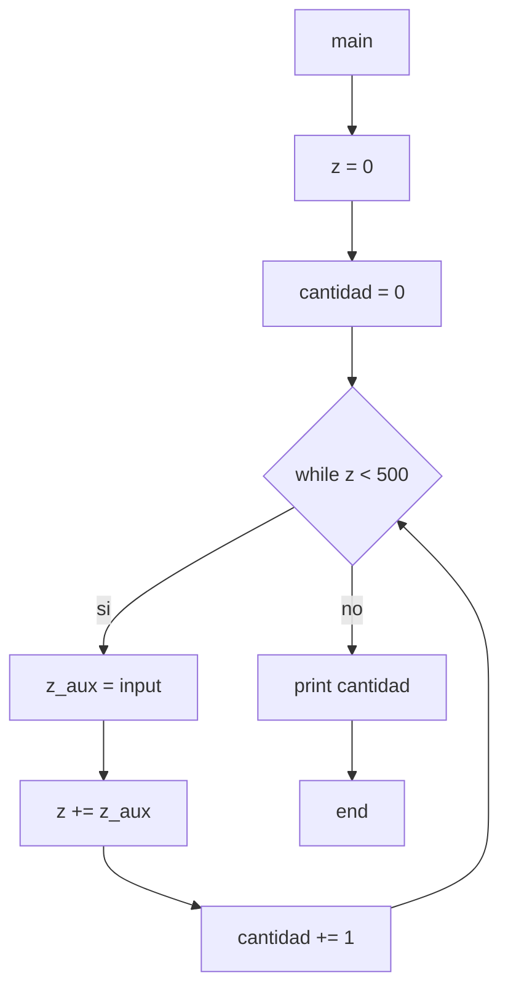

11) Ingresar números enteros en la variable Z, HASTA que la suma de los valores ingresados en Z
sea mayor a 500. Determinar e imprimir la cantidad de números ingresados.

Diagramas de flujo y calculos de complejidad:

***

* *main*:
    * V(G) = R = 2
    * V(G) = A-N+2 = 9-9+2 = 2
    * V(G) = P+1 = 1+1 = 2
