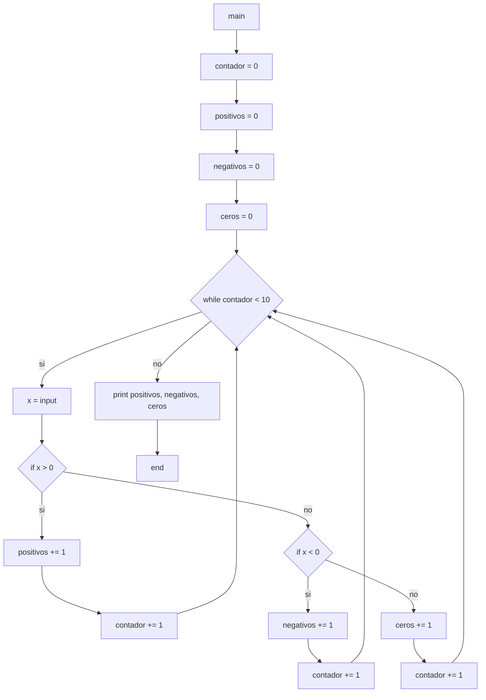

12) Ingresar 10 números enteros usando la variable X. Determinar e imprimir un mensaje
informando: la cantidad de números POSITIVOS, la cantidad de números NEGATIVOS y, la
cantidad de CEROS ingresados.

Diagramas de flujo y calculos de complejidad:

***

* *main*:
    * V(G) = R = 4
    * V(G) = A-N+2 = 19-17+2 = 4
    * V(G) = P+1 = 3+1 = 4
