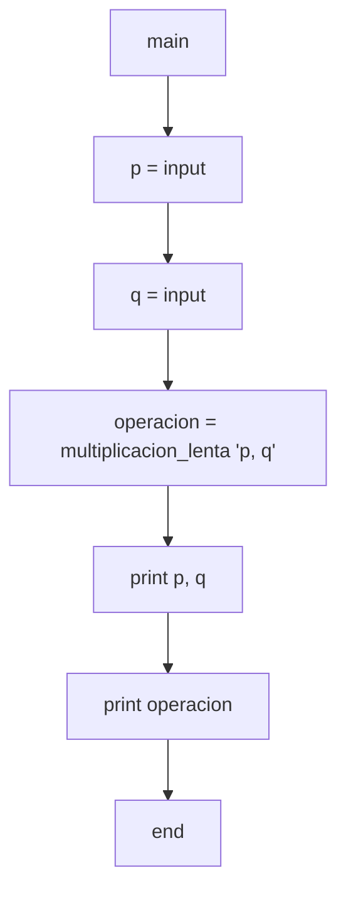
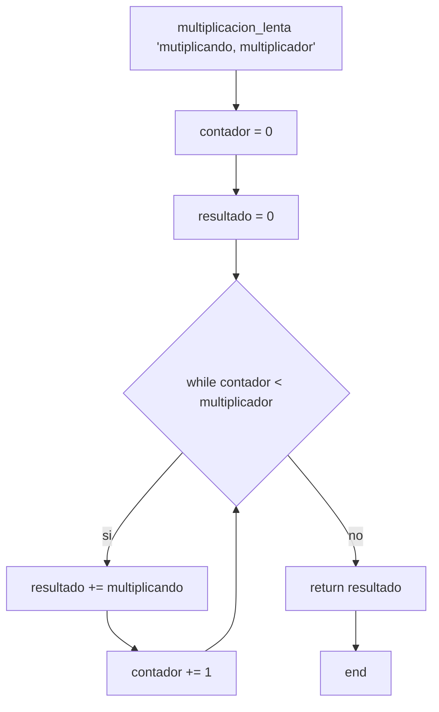

13) Ingresar 2 números naturales P y Q, donde P representa el multiplicando y Q el multiplicador.
Se pide que, utilizando solamente la operación de suma, calcule el resultado de la operación P * Q
e imprima el valor de P, de Q y de P * Q.

Diagramas de flujo y calculos de complejidad:

***

* *main*:
    * V(G) = R = 1
    * V(G) = A-N+2 = 6-7+2 = 1
    * V(G) = P+1 = 0+1 = 1

* *multiplicacion_lenta*:
    * V(G) = R = 2
    * V(G) = A-N+2 = 8-8+2 = 2
    * V(G) = P+1 = 1+1 = 2
