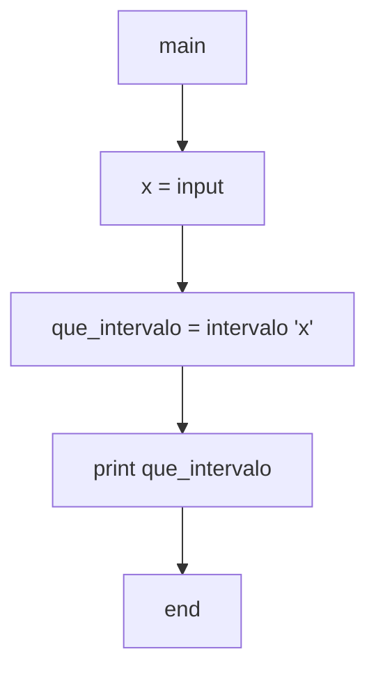
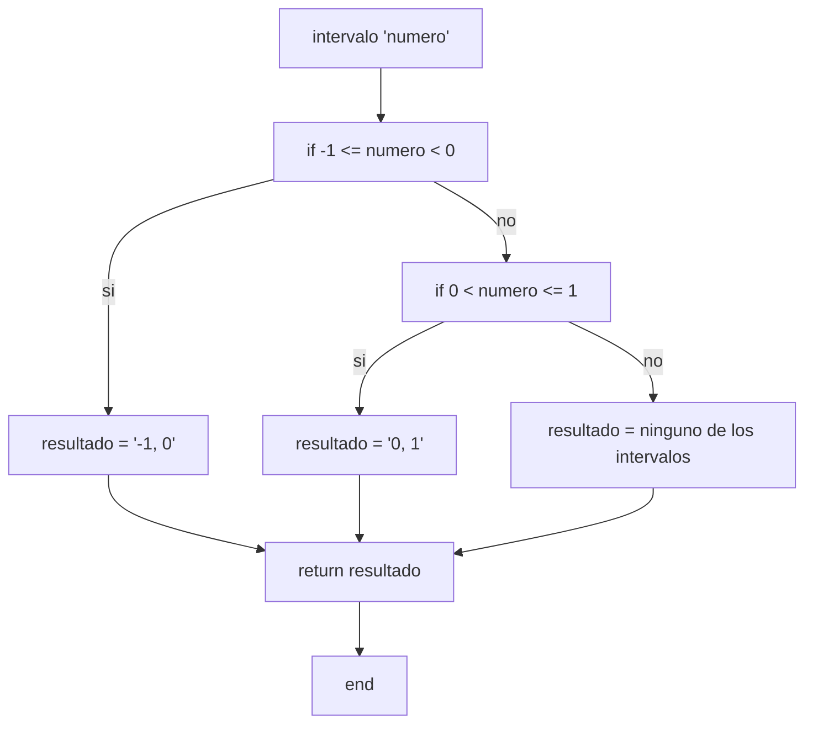

2) Escriba un diagrama de flujo que permita ingresar un valor numérico real en una variable llamada
X, y que determine si X pertenece o no, a alguno de los intervalos [-1; 0) o (0; 1] (o a ninguno de
ellos), imprimiendo un mensaje que diga a cuál intervalo pertenece.

Diagramas de flujo y calculos de complejidad:

***

* *main*:
    * V(G) = R = 1
    * V(G) = A-N+2 = 4-5+2 = 1
    * V(G) = P+1 = 0+1 = 1

* *intervalo*:
    * V(G) = R = 3
    * V(G) = A-N+2 = 9-8+2 = 3
    * V(G) = P+1 = 2+1 = 3
