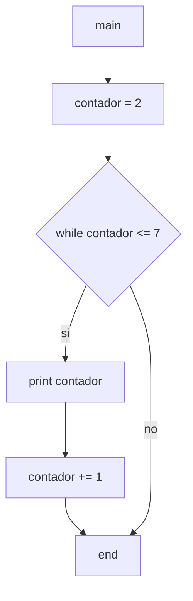

3) 6) Escriba un diagrama de flujo que permita generar e imprimir los primeros 5 números naturales
pares (a partir de 2).

Diagramas de flujo y calculos de complejidad:

***

* *main*:
    * V(G) = R = 2
    * V(G) = A-N+2 = 6-6+2 = 2
    * V(G) = P+1 = 1+1 = 2
