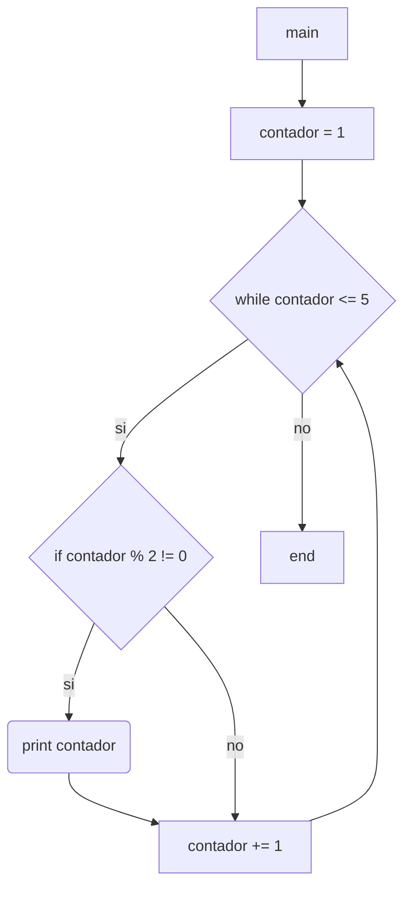

7) Escriba un diagrama de flujo que permita generar e imprimir los primeros 5 números naturales
impares (a partir de 1).

Diagramas de flujo y calculos de complejidad:

***

* *main*:
    * V(G) = R = 3
    * V(G) = A-N+2 = 8-7+2 = 3
    * V(G) = P+1 = 2+1 = 3

