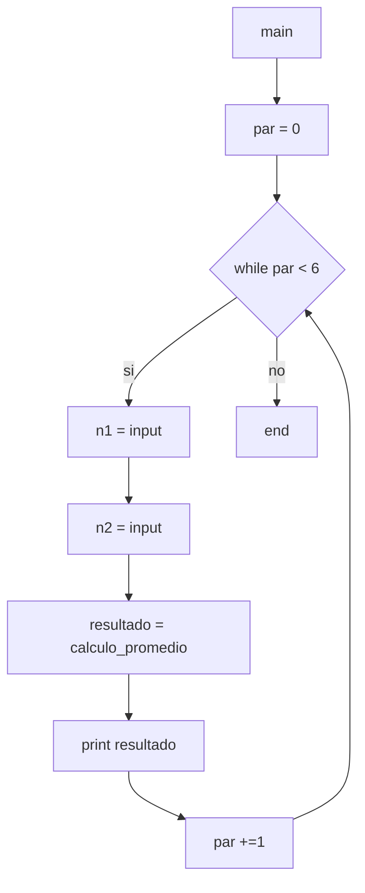
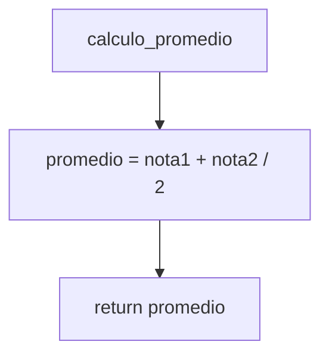

8) Escriba un diagrama de flujo que permita ingresar 6 pares de números naturales que representan
notas de parciales, en las variables N1 y N2, y que calcule e imprima el promedio de cada par de
notas.

Diagramas de flujo y calculos de complejidad:

***

* *main*:
    * V(G) = R = 2
    * V(G) = A-N+2 = 6-6+2 = 2
    * V(G) = P+1 = 1+1 = 2

* *calculo_promedio*:
    * V(G) = R = 1
    * V(G) = A-N+2 = 2-3+2 = 1
    * V(G) = P+1 = 0+1 = 1

