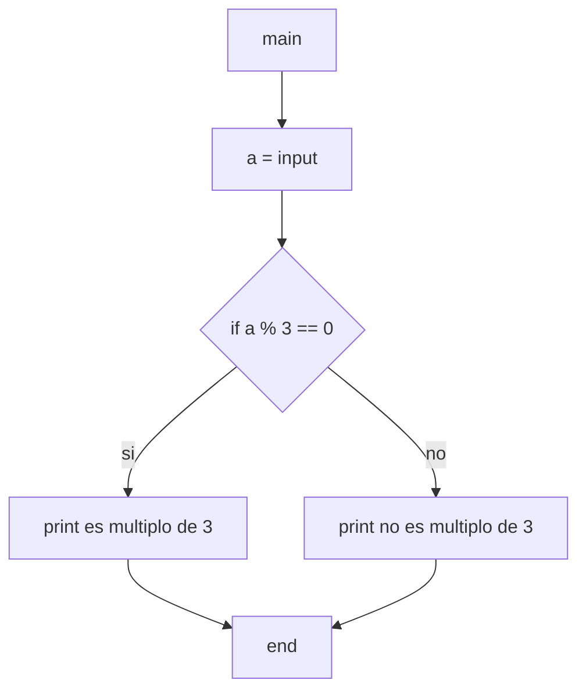

9) Ingresar un número natural en la variable A. Determinar e imprimir un mensaje informando: si A
es múltiplo de 3 o no.

Diagramas de flujo y calculos de complejidad:

***

* *main*:
    * V(G) = R = 2
    * V(G) = A-N+2 = 6-6+2 = 2
    * V(G) = P+1 = 1+1 = 2
